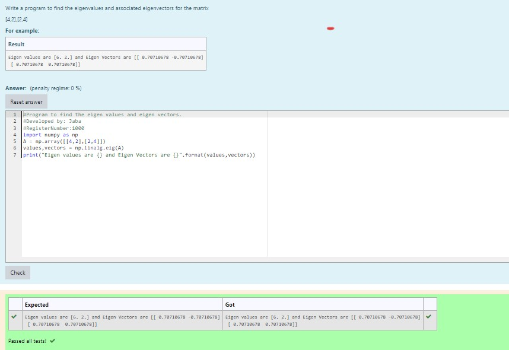

# EIGENVALUES-AND-EIGENVECTORS
## Aim:
To write a python program to find the Eigenvalues and Eigen Vectors
## Equipment’s required:
1. 	Hardware – PCs
2. 	Anaconda – Python 3.7 Installation / Moodle-Code Runner
## Algorithm:
### Step1 : import numpy package
### Step 2: Get the input matrix
### Step 3: Using the np.linalg.eig(),  we get two results (first is eigenvalue and second is eigenvector) of the given matrix.
### Step 4: print the result

## Program:

```python
import numpy as np
a = np.array ([1,2],[3,4]) 
value, vectors = np.linalg.eig(a)
print(a)
```

## Output:



## Result:
Thus the Eigenvalue and Eigenvector is successfully solved using python program
